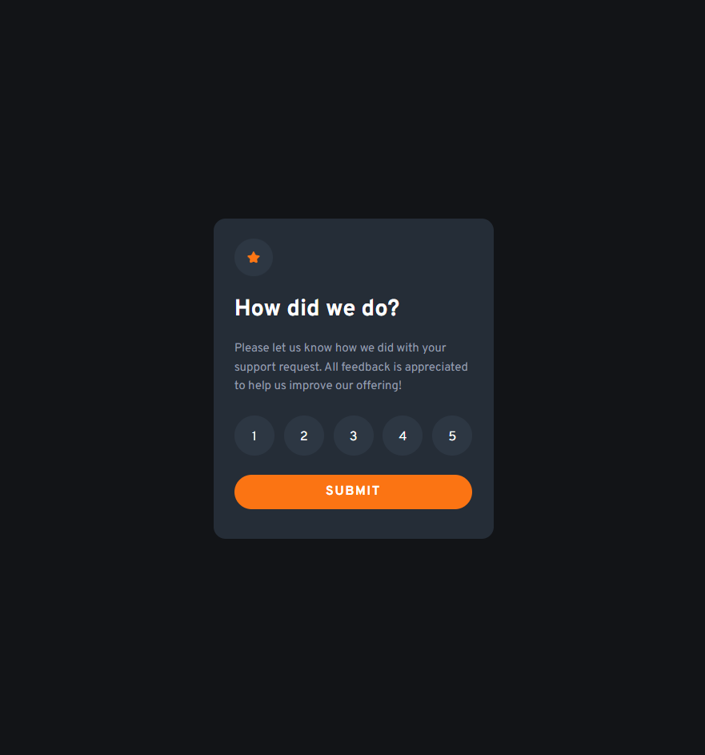

# Frontend Mentor - Interactive rating component solution

This is a solution to the [Interactive rating component challenge on Frontend Mentor](https://www.frontendmentor.io/challenges/interactive-rating-component-koxpeBUmI). Frontend Mentor challenges help you improve your coding skills by building realistic projects. 

## Table of contents

- [Overview](#overview)
  - [The challenge](#the-challenge)
  - [Screenshot](#screenshot)
  - [Links](#links)
- [My process](#my-process)
  - [Built with](#built-with)
  - [What I learned](#what-i-learned)
  - [Continued development](#continued-development)
- [Author](#author)

## Overview

- This project gave me the chance to practice my DOM Manipulation skills while having a refresher with my HTML and CSS styling and it seems to be coming easier every time. 
- I really enjoyed this project, It has been my favorite Front End Mentor Challenge yet. 

### The challenge

Users should be able to:

- View the optimal layout for the app depending on their device's screen size
- See hover states for all interactive elements on the page
- Select and submit a number rating
- See the "Thank you" card state after submitting a rating

### Screenshot




### Links

- Solution URL: [Solution](https://github.com/carlos-req/Interactive-Rating-Component)
- Live Site URL: [Live](https://carlos-req.github.io/Interactive-Rating-Component/)

## My process

- Semantic HTML
- CSS Styling
- JavaScript Functions


### Built with

- Semantic HTML5 markup
- CSS custom properties
- Flexbox
- Mobile-first workflow

### What I learned

In this project I really learned how to manipulate the DOM. I did this by adding stylings and then changing them using JavaScript.

JavaScript Code Snippet:

```js
let submit= ()=>{
  ratingState.classList.add('hidden');
  thankYouState.classList.remove('hidden');
};

submitBtn.onclick = submit;

rates.forEach( (rate) =>{
  rate.addEventListener('click', () => {
    rating.innerHTML = `You selected ${rate.innerHTML} out of 5`;
  })
});
```

### Continued development

In future projects, I would like to continue learning DOM manipulations and really connect all that I have learned of JavaScript with HTML & CSS and hopefully soon add some libraries or frameworks into the mix. 

## Author

- Website - [Carlos Requena](https://carlosjrequena.com/)
- Frontend Mentor - [@carlos-req](https://www.frontendmentor.io/profile/carlos-req)
- Twitter - [@CarlosReq11](https://twitter.com/CarlosReq11)

